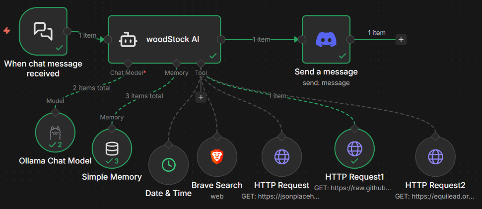

# Introduction Drag and Drops Features to AI Development

## ✍️ Overview
WoodStock AI

Jan 2026 - May 2026

My personal AI agent that can sent GET HTTP request to summarize cvs, pdf, and other files without having to know advance coding. This was all completed through n8n workflow platform

view my [Poster](https://docs.google.com/presentation/d/1_LcIgzyV_ZX9pf9LSXne1BpkyjMNedVF/edit?usp=sharing&ouid=106151378304154963111&rtpof=true&sd=true) I created on behalf of Siena university

## Resources i've learned and used
+ [n8n](https://n8n.io/?utm_source=paid_google&utm_medium=brand&utm_campaign=amer_us_prospecting_sem_google_brand_all-products_awareness_20251109&utm_content=responsive&utm_term=n8n&hstk_campaign=20722323063&hstk_network=googleAds&hstk_creative=678924652921&gad_source=1&gad_campaignid=20722323063&gclid=CjwKCAjwxb7RBhA5EiwAQ-AAdLgTDSi-q-Vc0u63mNJJmgsB_7Z77DtxGEUUOIb3XC01iZBnHNtUjBoCUoAQAvD_BwE) 
+ Cloud: [Hostdinger](https://www.hostinger.com/?utm_source=google&utm_medium=cpc&utm_id=2021374681&utm_campaign=Brand-Exact|NT:Se|LO:USA&utm_term=hostinger&utm_content=788864179358&gad_source=1&gad_campaignid=2021374681&gclid=CjwKCAjwxb7RBhA5EiwAQ-AAdNkvc8KN0dTxyQgHyAnZ67Cnui_l6sRZJcB-qBXdA3dHC8p8mh-FHxoCGwIQAvD_BwE), [AWS](https://aws.amazon.com/free/?trk=dc9b9d60-cc82-4cd5-8a61-0b33d6a79fab&sc_channel=ps&ef_id=CjwKCAjwxb7RBhA5EiwAQ-AAdL6l9m7v4hPf0zm6PxBA3VdVoi7I1o-3jxNO2WbZg67_fKkSE10SORoCMqEQAvD_BwE&gads_camp=23532472510&gads_ag=199502799824&gads_ad=795877020713&gads_kw=amazon%20web%20services&gads_matchtype=e&gads_network=g&gads_device=c&gads_geo=9004740&gad_campaignid=23532472510&gclid=CjwKCAjwxb7RBhA5EiwAQ-AAdL6l9m7v4hPf0zm6PxBA3VdVoi7I1o-3jxNO2WbZg67_fKkSE10SORoCMqEQAvD_BwE)
+ [Node.js] (https://nodejs.org/en) 
+ [Docker] (https://www.docker.com/)

## 🌟 API/tools nodes used in workflow
+ Discord
+ BraveSearch
+ HTTP GET Request
+ Ollama 
+ OpenAI
+ real time(Date Time)
+ telegram